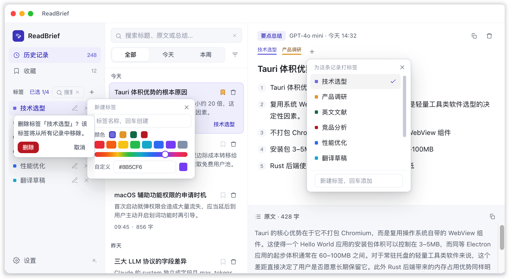
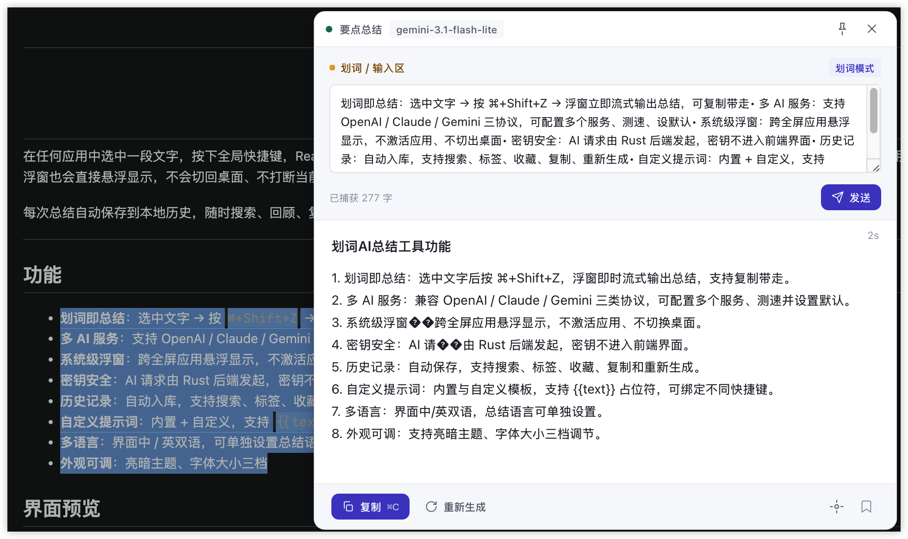
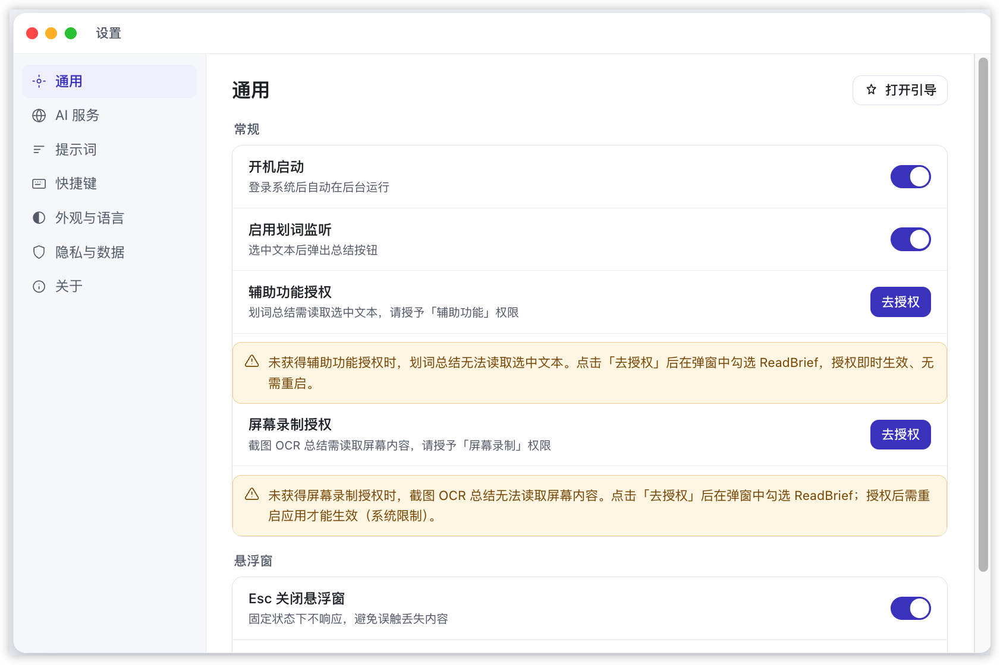
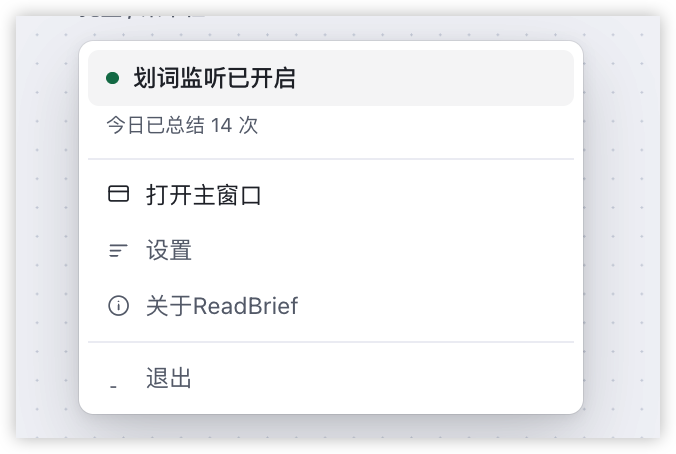

<p align="center">
  
</p>

<h1 align="center">ReadBrief</h1>

<p align="center"><b>划词即总结 · macOS / Windows 桌面 AI 阅读助手</b></p>

<p align="center">
  
  
  
  
</p>

---

在任何应用中选中一段文字，按下全局快捷键，ReadBrief 会读取选中内容并调用 AI **流式生成要点总结**，以系统级浮窗展示在光标附近——即使正全屏使用其他应用，浮窗也会直接悬浮显示，不会切回桌面、不打断当前工作。

每次总结自动保存到本地历史，随时搜索、回顾、复用。

---

## 功能

- **划词即总结**：选中文字 → 按 `⌘+Shift+Z` → 浮窗立即流式输出总结，可复制带走
- **多 AI 服务**：支持 OpenAI / Claude / Gemini 三协议，可配置多个服务、测速、设默认
- **系统级浮窗**：跨全屏应用悬浮显示，不激活应用、不切出桌面
- **密钥安全**：AI 请求由 Rust 后端发起，密钥不进入前端界面
- **历史记录**：自动入库，支持搜索、标签、收藏、复制、重新生成
- **自定义提示词**：内置 + 自定义，支持 `{{text}}` 占位符，可绑定到不同快捷键
- **参数覆盖**：两层自定义请求参数（服务级 / 快捷键级），主要用来关闭模型思考；DeepSeek 划词总结与翻译默认自动关思考
- **多语言**：界面中 / 英双语，可单独设置总结语言
- **外观可调**：亮暗主题、字体大小五档

## 界面预览

| 截图 | 建议文件名 | 应展示内容 |
| --- | --- | --- |
| 主界面 | `docs/images/main-window.png` | 历史记录页：列表 + 原文 / 总结对照 |
| 总结浮窗 | `docs/images/float-done.png` | 浮窗完成态：小标题 + 正文 + 底部操作栏 |
| 设置中心 | `docs/images/settings.png` | AI 服务 / 快捷键 / 提示词 / 外观等设置页 |
| 提示词管理 | `docs/images/prompts.png` | 提示词卡片列表 |
| 托盘菜单 | `docs/images/tray.png` | 菜单栏托盘状态与操作 |

<p align="center">
  <!-- TODO: 替换为主界面截图 -->
  
</p>

<p align="center">
  <!-- TODO: 替换为浮窗截图 -->
  
</p>

<p align="center">
  
</p>

<p align="center">
  
</p>

<p align="center">
  
</p>

## 快速开始

**系统要求**：macOS 13.0 及以上 / Windows 10 及以上

### macOS

1. 下载 `ReadBrief.dmg`，双击挂载，将 `ReadBrief.app` 拖入「应用程序」
2. 启动后，前往 **系统设置 → 隐私与安全性 → 辅助功能**，为 ReadBrief 开启权限（用于读取选中文本）
3. 打开 **设置 → AI 服务**，添加你的 AI 服务（协议 / API Key / 模型）
4. 在任意应用选中文字，按 `⌘+Shift+Z` 即可总结

> ⚠️ **无法验证开发者 / 打不开？** 当前为开发 / 免费阶段构建，尚未进行 Apple 公证（Notarization），属正常现象：
>
> **安装包（.dmg）双击打不开**
> - 前往 **系统设置 → 隐私与安全性**，滚动到底部点「仍要打开」
> - 或在终端解除隔离标记（直接将 dmg 文件拖入终端）：`xattr -cr <dmg 路径>`
>
> **首次打开 App 提示「无法验证开发者」**
> - 右键点击 `ReadBrief.app` → **打开**，在弹窗中再次点「打开」
> - 或前往 **系统设置 → 隐私与安全性**，滚动到底部点「仍要打开」
> - 或在终端执行 `xattr -cr /Applications/ReadBrief.app` 解除隔离标记
>
> 后续配置 Apple 开发者证书并公证后，该提示即会消失。

### Windows

1. 下载 `ReadBrief_x.y.z_x64-setup.exe`，双击运行安装向导完成安装
2. 首次启动若被 SmartScreen 拦截，点「更多信息」→「仍要运行」（开发 / 免费阶段构建未签名，属正常现象）
3. 打开 **设置 → AI 服务**，添加你的 AI 服务（协议 / API Key / 模型）
4. 在任意应用选中文字，按 `Ctrl+Shift+Z` 即可总结

> ⚠️ **SmartScreen 拦截？** 当前为开发 / 免费阶段构建，尚未进行 Authenticode 代码签名，被拦截属正常现象。点「更多信息」→「仍要运行」即可继续；后续完成代码签名后该提示即会消失。

## 使用说明

- 选中文字后按快捷键，浮窗出现在光标附近并自动开始总结；未捕获到文本时，可手动粘贴后按 `Enter` 总结
- 浮窗内可：复制（`⌘C`）、重新生成（`⌘R`）、固定（`⌘P`）、切换提示词、收藏
- 主窗口可浏览全部历史，搜索、打标签、收藏、重新生成、删除

## 快捷键

| 功能 | 快捷键 |
| --- | --- |
| 呼出浮窗并总结 | `⌘ + Shift + Z`（可自定义） |
| 复制总结 | `⌘ C` |
| 重新生成 | `⌘ R` |
| 固定浮窗 | `⌘ P` |
| 发送 / 总结 | `Enter`（`Shift+Enter` 换行） |
| 退出 | `Esc` |

> 快捷键中 macOS 使用 `⌘`（Command），Windows 使用 `Ctrl`，如划词总结为 `⌘+Shift+Z` / `Ctrl+Shift+Z`。

## 参数覆盖

思考型模型会明显拖慢划词总结。ReadBrief 提供两层「参数覆盖」，用 JSON 自定义 API 请求参数，发送时深合并：

| 层级 | 位置 | 作用 |
| --- | --- | --- |
| 服务级 | 设置 → AI 服务 → 编辑服务的「参数覆盖」 | 该服务所有请求的基础补充 |
| 快捷键级 | 设置 → 快捷键 → 「参数覆盖」按钮 | 按用途精调，**同名参数以快捷键级为准** |

- 主要用途是关闭模型思考，例如中转网关常用的 `{"enable_thinking": false}`
- **DeepSeek 动态默认**：划词总结 / 翻译绑定 DeepSeek 协议服务时，默认自动关闭思考；清空即恢复
- 支持 `//` 注释；非法 JSON 只告警并跳过，不阻断总结；`model` / `messages` / `stream` / `max_tokens` 等系统字段会被忽略

## 技术栈

- 桌面框架：**Tauri 2**（Rust 后端 + WebView 前端）
- 前端：React + TypeScript + Vite
- 后端：Rust（AI 流式请求、全局快捷键、划词捕获、SQLite）
- 数据库：SQLite（本地历史）
- 平台特性：macOS 原生 NSPanel / Windows 原生窗口，均为系统级浮窗

## 从源码构建

```bash
npm install            # 安装前端依赖
npm run tauri dev      # 开发模式（热更新）
npm run tauri build    # 生产构建 → src-tauri/target/release/bundle/
```

需要 [Rust 工具链](https://rustup.rs/)、Node.js 22+；macOS 需 Xcode Command Line Tools，Windows 需 Visual Studio C++ 生成工具（含 Windows 10/11 SDK）与 WebView2 运行时。

## 常见问题

**划词读不到选中文本？**
部分应用（如 Safari）辅助功能属性不完整，可改用托盘菜单的「粘贴并总结」，或手动粘贴后按 Enter。

**密钥安全吗？**
密钥仅保存在本地配置文件中，AI 请求由后端发起，前端界面拿不到密钥。

**支持 Windows 吗？**
已支持。Windows 10 及以上可直接下载 `ReadBrief_x.y.z_x64-setup.exe` 安装使用，划词总结、系统级浮窗、历史记录等核心功能与 macOS 一致。

## 许可证

本项目基于 [MIT License](LICENSE) 开源。

Copyright (c) 2026 chjs

## 致谢

ReadBrief 的成长离不开以下社区与项目的启发与支持：

- [**linux.do 社区**](https://linux.do/) — 活跃的中文 AI/技术交流社区，学习和使用了很多ai编程方案。
- **WorkBuddy** — 陪伴本项目从设计到落地的智能助手。
- [**OpenCode**](https://github.com/opencode-ai/opencode) — 开源 AI 编码工具，开发效率的重要支撑。
- [**pot-desktop**](https://github.com/pot-app/pot-desktop) — 开源划词翻译工具,一些设计思路的参考。
- [**Bob 社区版**](https://github.com/ripperhe/Bob) — 划词翻译标杆工具的开源社区版本，产品定位与体验的灵感来源,一些设计参考。

---

<p align="center">ReadBrief · 划词即总结</p>
